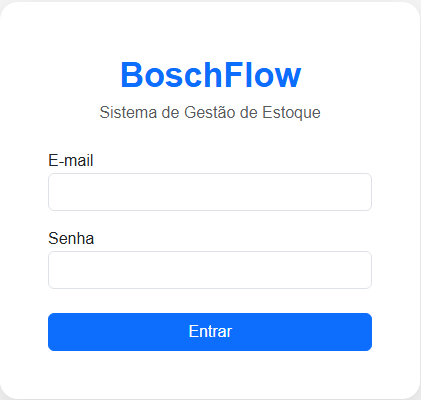
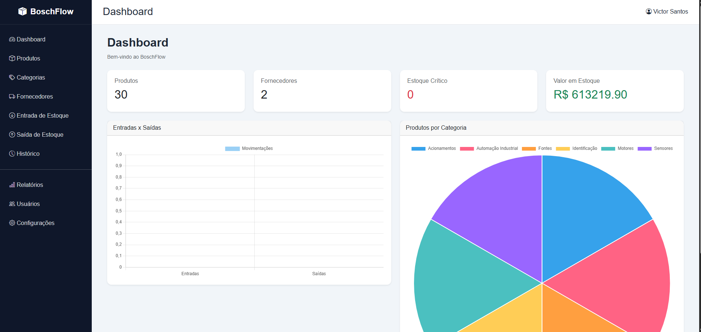

# BoschFlow

Sistema web de gerenciamento de estoque industrial desenvolvido em **Python utilizando Flask**.

O BoschFlow foi criado para simular uma aplicação utilizada em ambientes corporativos, permitindo o controle de produtos, fornecedores, categorias e movimentações de estoque.

O projeto envolve desenvolvimento backend, integração com banco de dados, autenticação de usuários e construção de uma interface administrativa completa.

---

## Funcionalidades

### 🔐 Autenticação

- Login de usuários
- Controle de sessão
- Usuário administrador


### 📦 Gestão de Produtos

- Cadastro, edição e exclusão de produtos
- Pesquisa de produtos
- Controle de quantidade em estoque
- Definição de estoque mínimo
- Associação com categorias e fornecedores
- Upload de imagens dos produtos


### 🔄 Controle de Estoque

- Registro de entrada de produtos
- Registro de saída de produtos
- Histórico de movimentações


### 🏷 Cadastros

- Gerenciamento de categorias
- Gerenciamento de fornecedores


### 📊 Dashboard

Painel com informações gerais do estoque:

- Quantidade de produtos cadastrados
- Quantidade de fornecedores
- Produtos com estoque crítico
- Valor total do estoque
- Indicadores de movimentação


### 📄 Relatórios

- Exportação de produtos para Excel
- Geração de relatórios em PDF


---

# Tecnologias utilizadas

### Backend

- Python
- Flask
- SQLAlchemy


### Banco de Dados

- SQLite


### Frontend

- HTML5
- CSS3
- JavaScript
- Bootstrap


### Bibliotecas

- OpenPyXL
- ReportLab
- Werkzeug


---

# Estrutura do projeto

```text
BoschFlow/

├── app.py
├── config.py
├── database.py
├── criar_admin.py
├── popular_banco.py

├── models/
│   ├── produto.py
│   ├── usuario.py
│   ├── fornecedor.py
│   └── categoria.py

├── routes/
│   ├── produtos.py
│   ├── fornecedores.py
│   ├── categorias.py
│   └── movimentacoes.py

├── services/
│   └── pdf_service.py

├── templates/

├── static/
│   ├── css/
│   ├── js/
│   └── uploads/

├── Screenshots/

└── requirements.txt
```

---

# Acesso para demonstração

Usuário disponível para testes:

```
Email:
demo@boschflow.com

Senha:
boschflow123
```

---

# Como executar

Clone o repositório:

```bash
git clone https://github.com/victorsantos-tech/BoschFlow.git
```

Acesse a pasta:

```bash
cd BoschFlow
```

Instale as dependências:

```bash
pip install -r requirements.txt
```

Execute a aplicação:

```bash
python app.py
```

Acesse no navegador:

```
http://127.0.0.1:5000
```

---

# Screenshots

## Login




## Dashboard




## Produtos


## Entrada de Estoque


## Saída de Estoque


---

# Objetivo do projeto

Projeto desenvolvido para aplicar conhecimentos em desenvolvimento web, banco de dados e criação de sistemas administrativos, utilizando uma arquitetura organizada e tecnologias utilizadas no mercado.

---

# Autor

**Victor Hugo dos Santos**

Engenharia de Software

GitHub:
https://github.com/victorsantos-tech